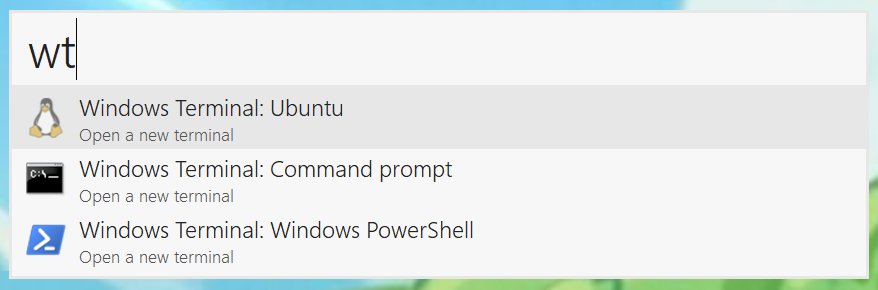

# Keypirinha Plugin: Windows Terminal Profiles

This is a plugin for the [Keypirinha](http://keypirinha.com) launcher, which adds catalog items
for all profiles defined in the [Windows Terminal](https://github.com/microsoft/terminal/)
configuration. Launching any of these items will open a new terminal with the chosen profile.

## Download and installation

Grab the most recent
[release package](https://github.com/fran-f/keypirinha-terminal-profiles/releases)
and copy it to the `InstalledPackages` directory of Keypirinha.

If you have installed Keypirinha, this will be under your profile folder, at
`%APPDATA%\Keypirinha\InstalledPackages`. If you are using it in *portable
mode*, look under `Keypirinha\portable\Profile\InstalledPackages`.

## License

This package is distributed under the terms of the MIT license.

